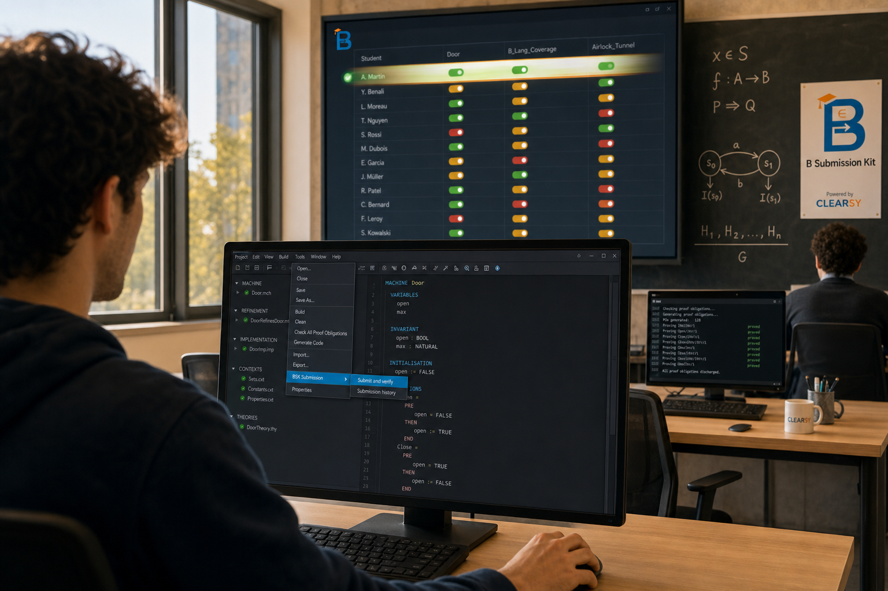

<p align="center"></p>

# B Submission Kit

A classroom verification toolkit for B-method projects: students submit from inside Atelier B with one click, the teacher watches a live dashboard and prints a PDF report at the end of the session.

Provided by [CLEARSY](https://www.clearsy.com) (Safety Solutions Designer); built around [Atelier B](https://www.atelierb.eu).

[](LICENSE) [](docs/LICENSE) [](install/)


## What it does

- A small Atelier B plug-in adds a **Project → BSK Submission** menu with two entries: *Connect* and *Submit and verify*.
- A FastAPI server on the teacher's PC receives submissions, runs `bbatch` (typecheck → POG → prove) and `probcli` (trace-replay animation against teacher-defined scenarios), and shows results on a live dashboard refreshing every 2 s.
- An on-demand PDF report bundles the per-(student × project) summary table with every embedded log into one archival document.

The whole stack uses no database, no cloud service, no external authentication. State lives in JSON; identity is dynamic and per-Atelier-B-installation.

## Quick start

### Teacher (Windows)

```
git clone https://github.com/CLEARSY/B-Submission-Kit.git
cd B-Submission-Kit
install\windows\install_server.cmd          (one time)
receiver\start_server.cmd                   (each session)
```

Then visit `http://<your-LAN-IP>:8000/` for the dashboard.

### Teacher (Linux)

```
git clone https://github.com/CLEARSY/B-Submission-Kit.git
cd B-Submission-Kit
bash install/linux/install_server.sh        # one time
bash receiver/start_server.sh               # each session
```

### Student (Windows)

After cloning the repo (or receiving the `install/windows/` folder from the teacher):

```
right-click install\windows\install_plugin.cmd  →  Run as administrator
```

Restart Atelier B, open a B project, then **Project → BSK Submission → Connect**.

### Student (Linux)

```
sudo bash install/linux/install_plugin.sh
```

Restart Atelier B and the menu entries appear under Project.

## Documentation

- **[docs/user_manual.md](docs/user_manual.md)**: full manual covering both student and teacher workflows, scenario format, dashboard reading, troubleshooting.
- **[docs/architecture.md](docs/architecture.md)**: components, data flows, state model, concurrency design, security and threat model, configuration surface, extension points.

## Project layout

```
B-Submission-Kit/
├── plugin/                    Atelier B plug-in source (Connect + Submit menu entries)
├── receiver/                  FastAPI server, dashboard, verification pipeline
│   ├── server.py              HTTP endpoints + queue worker
│   ├── verify.py              bbatch + probcli driver (teacher-replaceable)
│   ├── state.py               JSON-backed in-memory state with auth helpers
│   ├── dashboard.html         single-page browser UI (vanilla JS)
│   └── scenarios/<Project>/   per-project animation scenarios
├── install/                   one-time setup scripts
│   ├── windows/install_server.cmd
│   ├── windows/install_plugin.cmd
│   ├── linux/install_server.sh
│   └── linux/install_plugin.sh
├── tests/                     functional / regression simulation harness
│   ├── simulate_classroom.py  10 students × 2 projects, no Atelier B needed
│   └── projects/<Project>/    perfect + broken source fixtures
└── docs/                      user manual and architecture documentation
```

## Verification pipeline

For each submission, the server runs:

1. **typecheck**: `bbatch ... m t`
2. **POG**:       `bbatch ... m po 0`
3. **prove**:     `bbatch ... m pr 0`
4. **animate**:   `probcli <impl> -trace_replay prolog <scenario>` for each `.scenario` configured (up to 5 per project)

Each stage's verdict is one of `ok` / `partial` / `fail` / `skipped`. The overall row badge is green / amber / red per the rule:

- `ok` if every stage succeeded,
- `fail` if no stage succeeded,
- `partial` otherwise.

## Security

A first-come-first-serve name claim with a server-issued secret. The first time a student `Connect`s under a name, the server issues them a 32-character token and stores it in their `%APPDATA%\BSKSubmissionKit\config.json`. A different machine claiming the same name without the token gets HTTP 409. Every `Submit` carries the token, and the server rejects mismatches with 401. The dashboard is public-readable but never exposes the secret.

See [docs/architecture.md §7](docs/architecture.md#7-security) for the full threat model and limitations.

## Requirements

| Component | Required by | Tested with |
|---|---|---|
| **Atelier B** Community Edition 24.04.2+ | server (`bbatch`) and plug-in install | CE 24.04.2, Pro 25.02 |
| **ProB** (probcli) | server animation stage | ProB 1.16.0 |
| **Python 3.9+** | server (FastAPI) and plug-in client | CPython 3.13 |
| **Microsoft Edge** | server PDF report rendering | Edge 130+ |

The plug-in client is **stdlib-only**: no `pip install` needed on student machines. The server installs `fastapi`, `uvicorn[standard]`, and `python-multipart` into a local `.venv/`.

## Contributing

Issues and pull requests welcome at <https://github.com/CLEARSY/B-Submission-Kit>. The codebase is small (≈2000 LOC across server, plug-in, and tests) and favours obviousness over abstraction.

## License

Dual-licensed:

- **Source code** (everything outside `docs/`): MIT, see [LICENSE](LICENSE).
- **Documentation, screenshots and generated PDFs** (everything under `docs/`): Creative Commons Attribution 4.0 International (CC BY 4.0), see [docs/LICENSE](docs/LICENSE) or <https://creativecommons.org/licenses/by/4.0/>.

The bundled `share/plugins/Plugin_Development_Manual.pdf` and Atelier B documentation excerpts under `docs/` are reproduced under their original (CC BY) terms; see those files for details.
