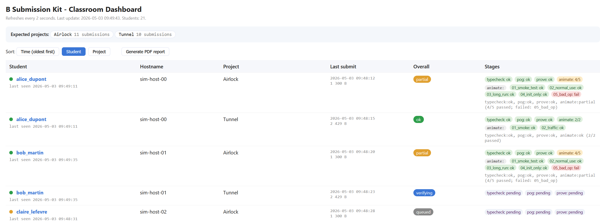
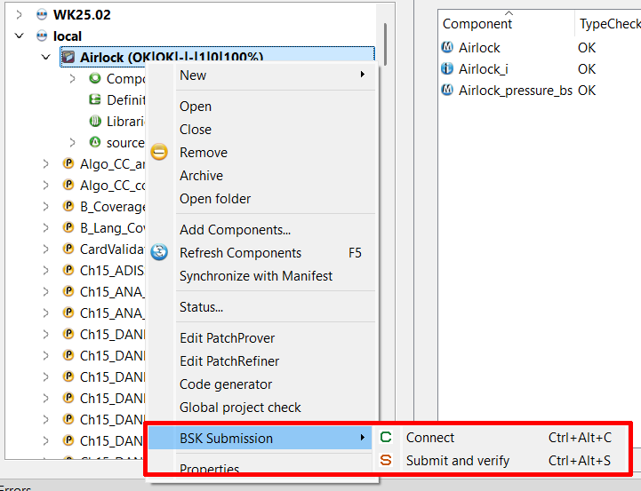
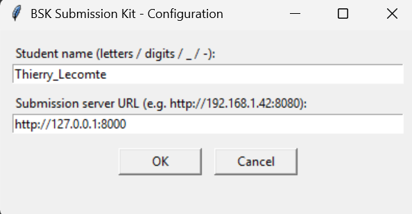
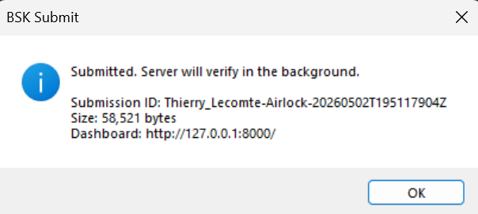
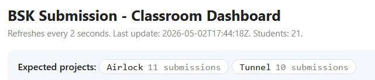
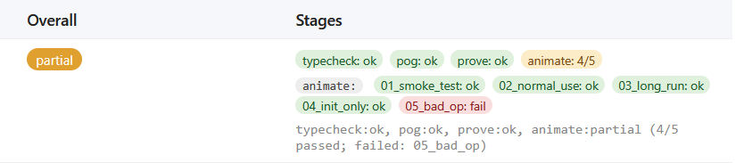

# BSK User Manual

**Project:** B Submission Kit
**Repository:** <https://github.com/TProver/B-Submission-Kit>
**Audience:** students using the plug-in, and teachers running the classroom server.

---

## 1. Overview



BSK lets a teacher run a classroom session in which students working in Atelier B submit their B projects to a verification server with one click. The server runs a four-stage pipeline (typecheck, proof-obligation generation, proof, ProB animation), aggregates the results on a live dashboard, and produces an archival PDF report on demand.

Roles:

- **Student**: installs a plug-in inside Atelier B once, then uses two menu entries during a session: *Connect* and *Submit and verify*.
- **Teacher**: installs the server on one machine on the classroom LAN, defines the expected projects and their animation scenarios, watches the dashboard live, generates a PDF report at the end of the session.

A single classroom server handles a cohort of up to ~50 students.

---

## 2. For students

### 2.1 Install the plug-in (once)

The teacher distributes the BSK plug-in folder (or a link to its installer). On Windows:

1. Open File Explorer in the `install/windows/` folder of the BSK distribution.
2. Right-click `install_plugin.cmd` → **Run as administrator**.
3. The installer copies six files (two `.etool` descriptors, the Python client, two PNG icons, and a small `.cmd` wrapper) into `C:\Program Files\Atelier B Community Edition 24.04.2 24.04.2\share\plugins\`.
4. Close and reopen Atelier B. You should see a new **Project → BSK Submission** submenu with two entries: **Connect** and **Submit and verify**.

On Linux: run `install/linux/install_plugin.sh` with `sudo` (it does the equivalent copy into the Atelier B `share/plugins/` folder).

You only need to do this once per machine.

### 2.2 Connect for the first time



1. Open any B project in Atelier B (the menu items are inactive until a project is open).
2. **Project → BSK Submission → Connect** (shortcut `Ctrl+Alt+C`).
3. A small dialog asks for:
   - **Student name** (letters, digits, `_`, `-`; this is what appears on the dashboard).
   - **Server URL** (the teacher tells you the address, e.g. `http://192.168.1.42:8000`).

   

4. Click **OK**. A confirmation popup appears with the dashboard URL, open it in your browser to see your row.

   

Behind the scenes, the server **claims your name for this Atelier B installation** and issues a short secret which the plug-in stores at `%APPDATA%\BSKSubmissionKit\config.json`. You will not be asked for it again unless you change machine or wipe that file.

### 2.3 Submit and verify

Once connected, every time you want the server to verify your project:

1. **Project → BSK Submission → Submit and verify** (shortcut `Ctrl+Alt+S`).
2. A small popup confirms the upload size and gives you the dashboard URL.
3. The server queues the verification. On the dashboard, the row for your project goes through `queued → verifying → ok | partial | fail`.

You can submit as many times as you like during the session; the server keeps only the latest submission per (you, project) pair.

### 2.4 Reading the dashboard

Open the dashboard URL in any browser. Refreshes every two seconds.

| Column | Meaning |
|---|---|
| **Student** | Your name. Click to download the full bbatch transcript for the latest submission of that project. |
| **Hostname** | The machine that submitted. |
| **Project** | The Atelier B project name. |
| **Last submit** | UTC timestamp + zip size. |
| **Overall** | One of three coloured badges. |
| **Stages** | Per-stage pills + a second row of per-scenario chips for animate. |

Overall verdicts:

| Badge | Meaning |
|---|---|
| `ok` (green) | every stage of the pipeline succeeded |
| `partial` (amber) | some stages succeeded, some did not (typical when a model proofs cleanly but one scenario diverges) |
| `fail` (red) | nothing succeeded (usually a typecheck or POG error early in the pipeline) |

Stage pills follow the same colours, plus `skipped` (italic grey) when an earlier stage prevented a later one from running. Hover any pill or scenario chip to see a tooltip; click it to open the full per-stage log in a new tab.

Sort buttons at the top of the dashboard let you reorder rows by **Time (oldest first)** (the default), by **Student**, or by **Project**. Your choice persists across page reloads.

The **Expected projects** banner above the table lists the projects the teacher has configured for this session. If you submit something with a different project name, your row will still appear but no scenarios will run.



Example of a row in the `partial` state, with per-scenario chips visible:



### 2.5 Common errors and what to do

| Symptom | Cause | Fix |
|---|---|---|
| `Cannot run BSKConnect` in Atelier B's *Errors* panel | Atelier B can't find Python | Set `BSK_PYTHON` env var to your `python.exe` path, or install Python 3.9+ from python.org with "Add to PATH" checked, then restart Atelier B |
| `Failed to reach http://...` popup | Server is not running, or wrong URL | Ask the teacher to confirm the URL; verify the LAN connection |
| `Name 'alice' is already taken` | Another machine already claimed that name | Pick a different name (e.g. `alice_2`) and run **Connect** again |
| `Invalid session, re-run Connect` on Submit | Token expired or server was restarted | Run **Project → BSK Submission → Connect** again, then re-Submit |
| Dashboard shows your row but the verdict is `fail` with `bbatch:fail` | Your model has a typecheck error | Open the row's `summary.log` link to see the bbatch error message; fix the model and resubmit |

---

## 3. For teachers

### 3.1 Start the classroom server

Once per session:

```
cd c:\Work\PROJECTS\CLAUDE\D06-BSubmissionKit\receiver
start_server.cmd
```

First run installs FastAPI, Uvicorn and a few transitive dependencies into a local `.venv/`. Subsequent runs skip the install and start the server in ~1 s. The dashboard becomes reachable on `http://<your-LAN-IP>:8000/`. Tell students that URL.

Useful flags:

| Command | What it does |
|---|---|
| `start_server.cmd` | Default (port 8000, keep all existing submissions) |
| `start_server.cmd 9000` | Port 9000 instead |
| `start_server.cmd --clean` | **Move** existing `submissions/` and `server_workspace/` into `archives/<timestamp>/` after a y/N confirmation, then start fresh |
| `start_server.cmd --purge` | **DELETE** existing submissions (irreversible; needs typing `DELETE` at the prompt) |
| `start_server.cmd --clean 9000` | Combine: archive then start on 9000 |

Equivalent on Linux: `bash receiver/start_server.sh` with the same flags.

### 3.2 Define the projects

The teacher chooses the project names that students must use. For each project, drop a directory under `receiver/scenarios/`. The *expected projects banner* on the dashboard lists exactly those directory names.

```
receiver/scenarios/
├── Airlock/
│   ├── 01_smoke_test.scenario
│   ├── 02_normal_use.scenario
│   ├── 03_long_run.scenario
│   ├── 04_init_only.scenario
│   └── 05_bad_op.scenario
└── Tunnel/
    ├── 01_smoke.scenario
    └── 02_traffic.scenario
```

Up to 5 scenarios per project (extra files are ignored). Each scenario file's name (without extension) is what appears on the dashboard's per-scenario chips.

### 3.3 Scenario format

Plain text, one operation call per line. Lines starting with `#` are comments; blank lines are ignored. Recognised forms:

```
# initialise the machine (no parameters)
init

# initialise the machine with parameters
init(0)

# CONCRETE_CONSTANTS (required first line if the machine has any)
setup_constants(100)

# fire an operation with no parameters
car_enter

# fire an operation with input parameters (int, bool, or verbatim ProB term)
op_pow(3)
do(3, TRUE)
exotic(avl_set(node(a, b)), 3)

# fire an operation and ASSERT its return value(s)
get_int -> 5
op_pow(3) -> 8
get_all_values -> 7, 3
```

Without `->` the operation must just fire successfully; with `->` ProB additionally checks that the returned values match.

The converter expands these into ProB Prolog-format trace files on the fly and runs `probcli -trace_replay prolog`. Per-scenario timeout is 30 s (covers ProB's first-load SICStus warm-up).

### 3.4 Watch the dashboard live

Open the dashboard URL on the teacher PC (and project it to the class screen if you like). It refreshes every two seconds. Rows appear in the order students submit; use the **Sort** buttons to switch between Time / Student / Project orderings.

Per-(student × project) row counts: with 10 students × 2 projects = 20 rows.

Each cell is interactive:

- The **student name** opens the full bbatch transcript for that submission.
- Each **stage pill** opens the per-stage log.
- Each **scenario chip** under animate opens that scenario's full probcli output.

### 3.5 Generate the PDF report

Click **Generate PDF report** in the dashboard's sort bar. The server:
1. Builds a self-contained HTML document with the per-(student × project) summary table at the top, plus every embedded log (the same content the dashboard's clickable links reveal).
2. Renders it to PDF via headless Microsoft Edge.
3. Saves it under `reports/<projects>_YYYYMMDDTHHMMSS.pdf` and opens it in a new tab.

`<projects>` is the alphabetical join of the project names submitted so far, truncated to 20 characters. Example file names:

- `Airlock_Tunnel_20260502T142315.pdf`
- `Airlock_Tunnel_Boiler_20260502T160500.pdf` (truncated if longer)

The PDF is the canonical archival artefact for grading and proof of verifications.


### 3.6 Manage student names

The first-come-first-serve scheme means a name cannot be claimed by two different machines:

- A student installed the plug-in and claimed `alice` from machine A.
- The same student then tries to **Connect** as `alice` from machine B → server returns HTTP 409 with the message *"Name 'alice' is already taken on this server. Choose another name and Connect again."*

If a student legitimately needs to recover their name (lost the plug-in config, reinstalled Atelier B), the teacher can release it manually:

1. Stop the server (`Ctrl+C` in the terminal).
2. Edit `submissions/_state.json`. Find the entry for the student id and remove its `"secret": "..."` line.
3. Restart `start_server.cmd`. The student can now re-Connect from any machine.

Alternatively, the student picks a new name (e.g. `alice2`), which is simpler.

### 3.7 End-of-session housekeeping

At the end of a teaching session:

1. (Optional) Click **Generate PDF report** one last time and archive the PDF wherever you keep grade records.
2. Stop the server (`Ctrl+C`).
3. For the next session, run `start_server.cmd --clean` so the previous cohort's data is moved into `archives/<timestamp>/` and the dashboard starts empty.

`archives/` is never auto-deleted; review and remove old archive folders manually when you no longer need them.

---

## 4. Reference

### 4.1 Scenario keywords

| Keyword | Maps to | Notes |
|---|---|---|
| `init` / `initialise_machine` | `'$initialise_machine'.` | Required if the machine has any state. |
| `init(args)` | `'$initialise_machine'(args).` | If INITIALISATION takes parameters. |
| `setup_constants(N1, N2, ...)` | `'$setup_constants'(int(N1), int(N2), ...).` | Required first line for any machine with `CONCRETE_CONSTANTS`. Without it, ProB rejects trace replay. |
| `op` | `'op'.` | No-arg, no-return. |
| `op(3, TRUE)` | `'op'(int(3), bool_true).` | Scalar args: integers, booleans (TRUE/FALSE/T/F), or verbatim ProB terms. |
| `op -> 5` | `'op'-->[int(5)].` | Asserts the return value. |
| `op(3) -> 8, FALSE` | `'op'(int(3))-->[int(8), bool_false].` | Multiple inputs, multiple returns. |

### 4.2 Server CLI flags and environment variables

```
start_server.cmd [PORT]              # default port 8000
start_server.cmd --clean [PORT]      # archive submissions/ + server_workspace/, then start
start_server.cmd --purge [PORT]      # DELETE submissions/ + server_workspace/ (DELETE-confirm)
```

| Env var | Default | Purpose |
|---|---|---|
| `BSK_BBATCH` | `C:\Program Files\Atelier B Community Edition 24.04.2 24.04.2\bin\bbatch.exe` | Atelier B `bbatch` binary |
| `BSK_PROBCLI` | `C:\Tools\ProB\probcli.exe` | ProB CLI binary |
| `BSK_EDGE` | `C:\Program Files (x86)\Microsoft\Edge\Application\msedge.exe` | Headless Edge for PDF report rendering |
| `BSK_PYTHON` | discovered via PATH | Python 3 interpreter for the plug-in client (student side) |
| `BSK_WORKSPACE` | `<project>/server_workspace` | Directory bbatch uses for its per-submission projects |
| `BSK_SCENARIOS` | `<project>/receiver/scenarios` | Scenarios folder root |

### 4.3 Files on disk

| Path | Purpose | Lifecycle |
|---|---|---|
| `submissions/_state.json` | In-memory state mirror; JSON snapshot rewritten after every change | Created on first submit; survives server restart |
| `submissions/<sid>/_incoming/<id>.zip` | Submit handler stages new uploads here | Moved into `_work_<id>/` by the worker, then removed |
| `submissions/<sid>/_work_<id>/` | Per-submission staging area for verification | Renamed to `latest_<project>/` when verify finishes |
| `submissions/<sid>/latest_<project>/` | Most-recent verification result per (student, project) | Atomic-rename target; consulted by dashboard log links |
| `server_workspace/` | bbatch project workspace, one folder per submission | Accumulates; reset by `--clean` |
| `archives/<ts>/` | Previous sessions' data, preserved | Manual cleanup when no longer needed |
| `logs/server.log` | Rotating log of every submit/verify/swap event + worker tracebacks | Rotates at 2 MB, keeps 4 backups |
| `reports/<projects>_<ts>.pdf` | Generated archival reports | Manually move to grade records |
| `receiver/scenarios/<Project>/` | Teacher-defined animation scenarios | Edited offline between sessions |

### 4.4 Where to ask for help

If something behaves unexpectedly, the first place to look is `logs/server.log`. Every submit, verify and worker step is logged with timestamp, student id, project name, and full stack trace on errors. Per-submission logs also live in `submissions/<sid>/latest_<project>/verification/`.
